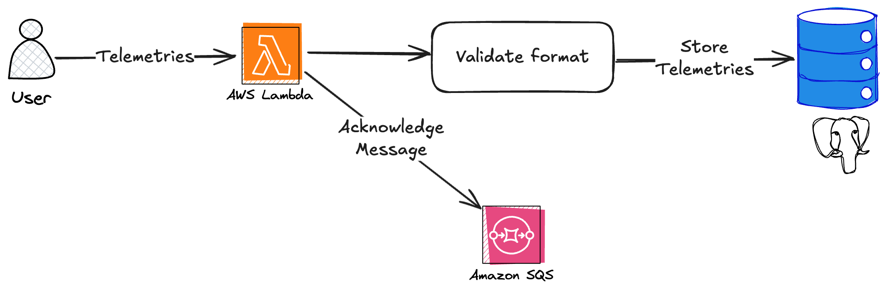

# Platform Engineer Exercise - Dream

## Overview
The system is built in a way that a Lambda function will be invoked by a remote source that will send telemetry data  
The data is sent and saved into a Postgres DB, each telemetry will be in a single row, and it is assumed that each source will send 1 telemetry for a single timestamp (although the function may receive multiple telemetries at a time)  
Afterward, a message will be sent to an SQS queue as an acknowledgement, while in certain errors (DB, validation, or other kinds of errors) the messages will be acknowledged in different queues for further inspection

### Diagram

***

## Local Tests
You can use `make test` to run tests locally using docker compose  
Note: the tests include 2 tests where exponential backoff takes place, and it might take ~30 seconds to run, don't worry

## Setup
The current state of the project is only to run local tests  
Running `make local` will set up the needed external services (postgres + AWS mock) locally for running the code  
In order to use it on cloud, code should be taken directly from the `app` folder, and environment variables should be set in order to use RDS, SQS and the various queues

### Environment Variables
#### DB
* DB_HOST - Sets the Database host, default is `postgres`
* DB_PORT - Sets the connection port for the DB, default is 5432
* DB_USER - Sets the username to connect to, default is `postgres`
* DB_PASSWORD - Sets the user password, default is `password`
* DB_NAME - Sets the database name to connect to, default is `postgres`

#### SQS
The following environment variables can be set to declare on the corresponding queue URL:
* success_sqs_queue
* validation_error_sqs_queue
* db_error_sqs_queue
* general_error_sqs_queue
* default_sqs_queue

***

## Considerations
### Optimizations
* Code was built in an asynchronous way, so many telemetries will be handled in parallel and DB or SQS communication won't block other telemetries processing (in case several telemetries were sent together)
* Setting up provisioned concurrency to a minimal amount (according to usage patterns across the day) can help keep a DB connection up and not set up a new one in case of cold starts, for that reason the DB connection was handled as a connection pool to be reused on sequential invocations
* Lambdas and SQS are auto-scaled according to usage, and will be able to process large volumes as needed

### DB considerations
* Postgres was used due to familiarity and ambiguity on the input format
* Since telemetries come in different ways, a DocumentDB may fit as well as it's schema free and the inputs are considered as JSONs
* But assuming sources are limited, a relational structure where more tables with extra data on the sources are linked and can be used to map data in more interesting ways seemed to be a better use case

### Lambda/SQS features
* No specific features were used except for general input-output streams
* A DLQ seemed to not fit this use case, as the SQS were the last station and in case of an error in processing, it wasn't relevant for retrying

***

## Disclosure
* I have never worked with or used SQS or Lambdas, I know them merely as concepts
* My main experience is with servers, therefore the code may be stylized more in that way
* Due to my unfamiliarity, I did use ChatGPT to get into speed, as it seemed that the task wasn't focused on using those tools professionally but rather using many tools and showing adaptability
* I might have misunderstood the background of the task and the acknowledgement mechanism, but the line of thought was to queue messages with different errors for retrying or inspection in a different place
* 